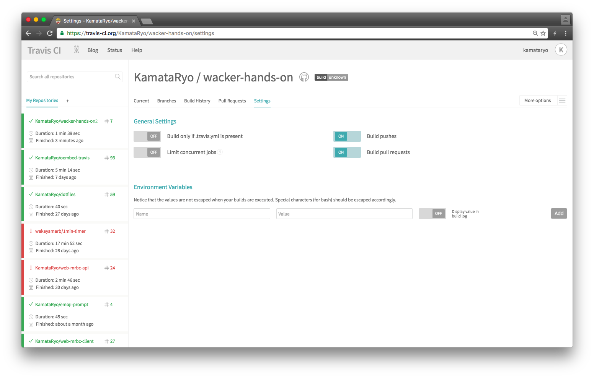

# wacker-hands-on

This is example remository for Github Hands-on@wacker #6

## 参考リンクなど

https://firegoby.jp/archives/6396


## Travis CIでセキュアな値を利用する

以下の操作を行うと、Travis CIのコンテナ内で環境変数KEY(=value)をセキュアに利用できます。
Travis CIのビルドログ上にvalueの値は表示されません。

### Webから操作する

https://travis-ci.org/KamataRyo/wacker-hands-on/settings



[settings] -> [Environment variable]から、表示・非表示を含めて設定できます。

### CLIから操作する

#### Travis CIのCLIツールをインストール

```
$ gem install travis
```

#### KEY=valueの形で値を暗号化

出力される文字列をコピペします。

```
$ travis encrypt KEY=value
```

```
$ vi .travis.yml

env:
  global:
  - secure: "{{出力された値を記載}}"
```

あるいは、--addオプションを使うと、自動で`.travis.yml`に追記されます。

```
$ travis encrypt KEY=value --add
```

## Githubにアクセスするためのアクセストークンを取得する

github.comから取得できます。

https://github.com/settings/tokens/new

上記のURLから最小の権限を設定すると、自分のすべてのリポジトリにアクセスできるアクセストークンが得られます。リポジトリ毎など、もっと権限を切り分けたいのですが、方法がわかりません。ご存知の方がおられたら教えて下さい。

アクセストークンを使うと、以下のようなURLでGithubのリモートリポジトリにアクセスできます。
```
# プッシュする例
$ git push https://{{TOKEN}}@github.com/{{user}}/{{repo}} master
```

私は以下のようなデプロイ用スクリプトを使っています。
https://raw.githubusercontent.com/KamataRyo/travis-sctipts-collection/master/deploy-gh-pages.sh
